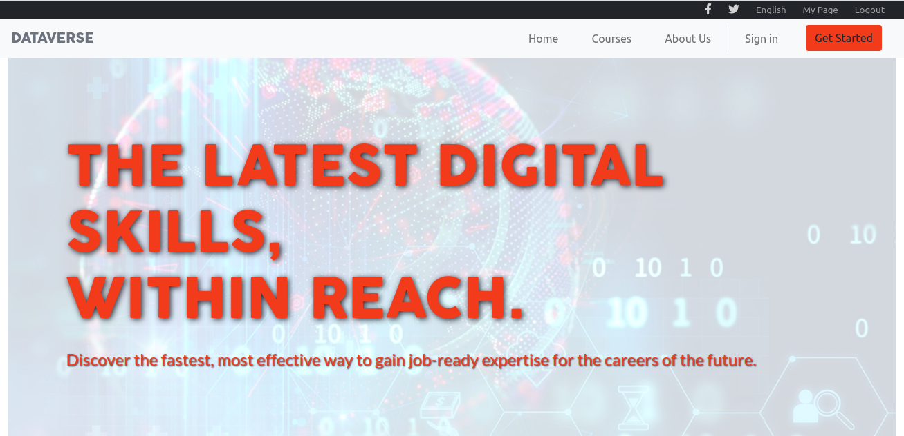
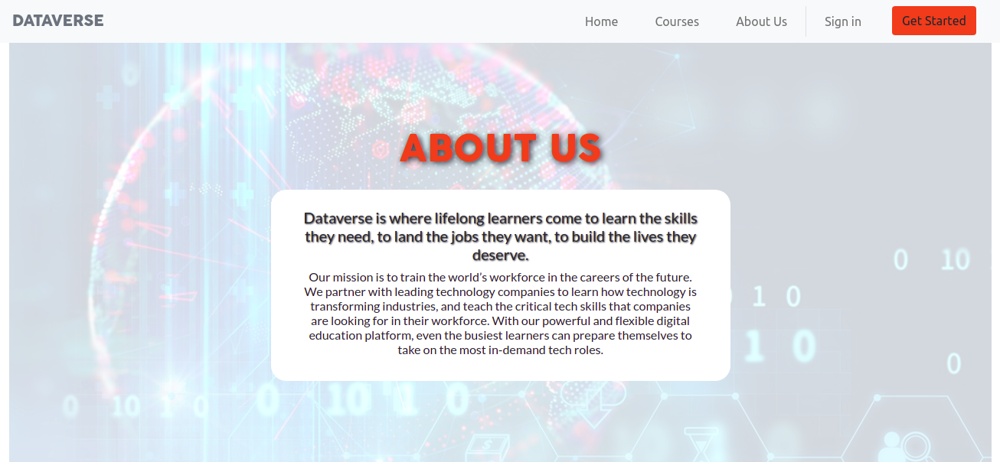
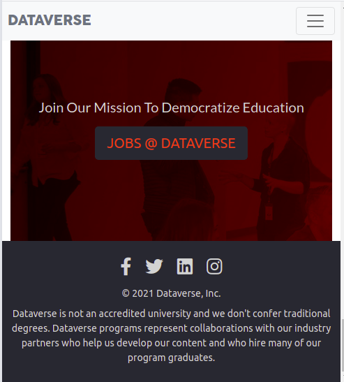

# Data School Webpage - HTML/CSS Capstone Project

> This is the Capstone project for the Microverse HTML/CSS module. A webpage inspired on the [Creative Commons Global Summit 2015](https://www.behance.net/gallery/29845175/CC-Global-Summit-2015) website was implemented.

The main purpose of this project is to put into practice the concepts of **Layout**, **Flexbox**, **Grid** and **Bootstrap**. Indispensable tools for a Web Developer. 

## Desktop view

## Mobile view

## Video Description

- Check out [this](https://www.loom.com/share/b23377c8987f47d692145b3257a4ab02) short Loom description of the project.

## Built With

- HTML/CSS/Bootstrap

## Live Demo

[Live Demo Link](https://john-arboleda.github.io/DataSchoolPage/)

To get a local copy up and running follow these simple example steps.

### Prerequisites

- Having any popular browser like Chrome, Firefox, Edge, Safari

### Setup

- Download or clone this repository on your computer, run the index.html file with a browser

## Authors

👤 **John Arboleda**

- GitHub: [@john-arboleda](https://github.com/John-Arboleda)

## 🤝 Contributing

Contributions, issues, and feature requests are welcome!

Feel free to check the [issues page](issues/).

## Show your support

Give a ⭐️ if you like this project!

## Acknowledgments

- The content and images are from [udacity.com](https://www.udacity.com/)

## 📝 License

This project is [MIT](lic.url) licensed.
